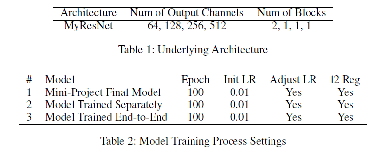
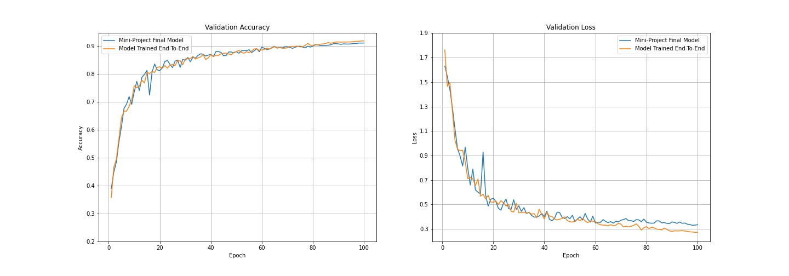

# CS-GY 6953 Deep Learning Project

## Introduction
The main idea of contrastive learning is that, by minimizing a contrastive loss, the model is driven to learn an 
embedding space that pulling together those similar items (positive pairs) while pushing away the dissimilar
ones (negative pairs). The contrastive setting helps the model better capture the relationships between each pair of
the instances in the dataset, and thus generate a better way of understanding the features. Besides, it helps prevent 
the models from learning unintended features and thus prevent model collapse. Recent ideas using contrastive learning 
always treat the negative pairs as equally negative, such as MoCo (He, et al., 2020). However, we consider that not all
negative pairs contribute equally to the final loss, and thus, we incorporate ISD (Tejankar, et al., 2021) into the 
training of our model and find its superiority.

ISD extends standard contrastive learning methods such as MoCo while borrows the idea of Momentum from it. ISD relaxes 
the binary distinction between the positive and negative pairs with soft similarity for negative images. ISD also 
utilizes the idea of Knowledge Distillation; while the teacher network and the student network are both trained from 
scratch, the teacher is updated with a momentum and therefore the teacher is a moving average of the student.

In this project, we followed the method in ISD paper to build a backbone with MyResNet which we developed in the 
mini-project as the underlying architecture, and append a fully connected classifier layer to the backbone for a 
downstream classification task on the CIFAR-10 dataset. 

link to mini-project: [link to mini project](https://github.com/subeihan/deep-learning-miniproject)

## Experiment Setups
We have two experiment setups as described below.
* The first one is similar to the one in ISD paper, where a backbone is first pretrained, and then a classifier head
is appended and tuned to perform the final classification task. The backbone is frozen while the classifier is trained.
* In the second experiment, we combine the training of the ISD backbone with the training of the downstream classifier; 
the loss is a linear combination of the ISD loss and the classification loss.

In both of the experiments, we use MyResNet as the underling architecture, which is the same as that in our 
mini-project. As shown in Table 1, it has four residual layers. The number of residual blocks in the four layers 
are 2, 1, 1, and 1 respectively; and the number of output channels in the four layers are 64, 128, 256 and 512 
respectively. This architecture has less than 5 million parameters.

## Experiment Results

With the second experiment setup, where the training of the feature encoding backbone and the training of the linear
classifier head is combined, and the loss function is the sum of the cross-entropy loss and the KL divergence loss, 
the training was rather supervised than self-supervised. However, the contrastive loss we borrowed from the 
self-supervised domain did help improved the accuracy and stability, as shown in the paragraphs below. 

